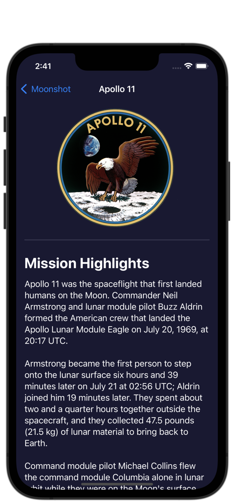
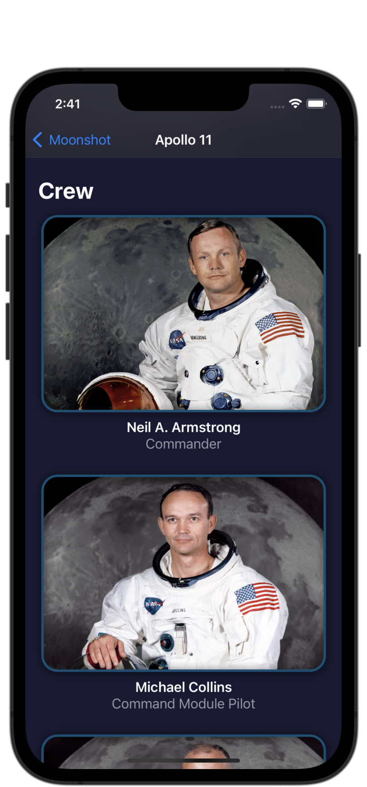
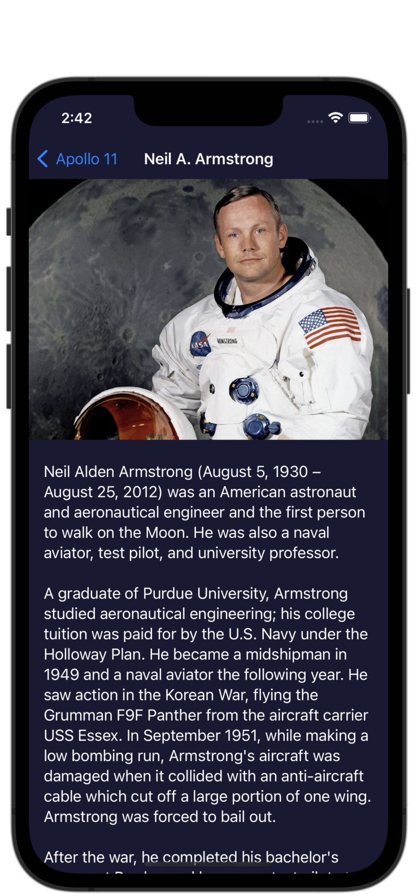

#  Project 8 - Moonshot

[Day 39 - Moonshot Part One](https://www.hackingwithswift.com/100/swiftui/39)

[Day 40 - Moonshot Part Two](https://www.hackingwithswift.com/100/swiftui/40)

[Day 41 - Moonshot Part Three](https://www.hackingwithswift.com/100/swiftui/41)

[Day 42 - Moonshot Part Four](https://www.hackingwithswift.com/100/swiftui/42)

## Topics

* NavigationLink
* GeometryReader
* ScrollView
* Codable
* Resizing images
* Grid layouts

## Challenges

1. Add the launch date to MissionView, below the mission badge. You might choose to format this differently given that more space is available, but it’s down to you.
2. Extract one or two pieces of view code into their own new SwiftUI views – the horizontal scroll view in MissionView is a great candidate, but if you followed my styling then you could also move the Rectangle dividers out too.
3. For a tough challenge, add a toolbar item to ContentView that toggles between showing missions as a grid and as a list.

## Screenshots

### Base app

    
    
    
    
                

### Challenges

Screenshots will go here eventually.

<!--
-->
<!--    -->
<!--    -->
<!--
-->
